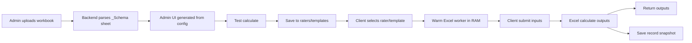

# Cogitate Rater Engine

## Project Overview
This project converts Excel-based pricing models into a web application without rewriting formulas into another language. It uses a FastAPI backend and native Microsoft Excel COM automation (`win32com`) to calculate outputs using the original workbook logic.

The goal is to let teams keep Excel as the source of truth while providing a fast, auditable web experience for both administrators and business users.

## What Problem This Solves
- Removes manual reimplementation of Excel formulas in backend code.
- Reduces time to expose new pricing models to users.
- Preserves native Excel behavior by calculating in Excel itself.
- Supports auditability by saving immutable execution records.

## Admin Panel and Client Panel

### Admin Panel
The Admin panel is used by product or operations teams to onboard and validate rating models:
1. Upload an `.xlsx` workbook.
2. Parse the `_Schema` sheet into a dynamic configuration.
3. Run test calculations.
4. Save the model into `raters/` or `templates/`.

### Client Panel
The Client panel is used to execute approved raters:
1. Select a saved rater or template.
2. Load the generated input form.
3. Submit inputs and get outputs.
4. Persist execution metadata into `records/`.

## End-to-End Flow


## Excel `_Schema` Sheet Format
Each workbook must include a sheet named `_Schema`. The parser expects columns A-H:

| Column | Name | Required | Description |
|---|---|---|---|
| A | `field` | Yes | Unique field key used in payload/config |
| B | `cell` | Yes | Excel cell reference (example: `D12`) |
| C | `type` | Yes | Field type (`text`, `number`, etc.) |
| D | `label` | Yes | Display label used in UI |
| E | `direction` | Yes | `input` or `output` |
| F | `group` | no | UI grouping label |
| G | `options` | No | Semicolon-separated values; creates dropdown |
| H | `default` | No | Default value for the field |

If `direction` is omitted, the row defaults to `input`. If `options` is present, the input is rendered as a dropdown.

### Example `_Schema` rows
```csv
field,cell,type,label,direction,group,options,default
state,D5,text,State,input,Risk,"CA;TX;NY",CA
building_limit,E5,number,Building Limit,input,Coverage,,500000
deductible,E6,number,Deductible,input,Coverage,"500;1000;2500",1000
premium,H20,number,Premium,output,Results,,
```

## Repository Structure
```text
cogitate rater/
├── Dockerfile             # Windows Server Core Docker container configuration
├── docker-compose.yml     # Docker service orchestration
├── configuration.xml      # Microsoft Office Deployment Tool XML configuration
├── setup.exe              # Microsoft Office Deployment Tool setup executable
├── requirements.txt       # Root Python dependencies
├── backend/
│   ├── main.py            # FastAPI entrypoint (routes for admin, raters, templates, records)
│   ├── schema_parser.py   # Parses Excel _Schema sheet into JSON configuration
│   ├── engine.py          # Calculation engine orchestration
│   ├── excel_worker.py    # Native Excel COM worker lifecycle (win32com)
│   ├── warm_sessions.py   # Active worker session pool management
│   ├── registry.py        # Storage registry for raters & templates
│   ├── config.py          # Application configuration
│   └── requirements.txt   # Backend dependencies
├── web-next/
│   ├── src/app/admin/     # Admin panel pages (upload & test models)
│   ├── src/app/tester/    # Client panel pages (run calculations)
│   └── src/components/    # UI components
├── raters/                # Saved production raters
├── templates/             # Base template raters
├── uploads/               # Temporary uploaded workbook sessions
└── records/               # Immutable calculation history logs
```

## Run the System (Detailed)

### Prerequisites
- Windows 10/11 (or Windows Server)
- Microsoft Excel installed locally (for local non-Docker mode)
- Python 3.9 to 3.11
- Node.js 18+

### 1) Clone the repository
```powershell
git clone https://github.com/tanmay5110/cogitate-code-review.git
cd cogitate-code-review
```

### 2) Start backend (Terminal 1)
```powershell
cd "cogitate rater/backend"

python -m venv .venv
.\.venv\Scripts\activate

pip install -r requirements.txt
uvicorn main:app --host 127.0.0.1 --port 8000 --reload
```

Backend URL: `http://127.0.0.1:8000`  
Swagger docs: `http://127.0.0.1:8000/docs`  

### 3) Start frontend (Terminal 2)
```powershell
cd "cogitate rater/web-next"

npm install
npm run dev
```

Frontend URL: `http://localhost:3000`  


### 4) Use the app
1. Open `http://localhost:3000/admin` and upload an Excel file with `_Schema`.
2. Test calculate in Admin.
3. Save as a rater/template.
4. Open client/tester panel and run real calculations.

## API Quick Reference
- `GET /api/health` - backend health
- `POST /api/admin/upload` - upload workbook and parse schema
- `POST /api/admin/test-calculate` - run test with upload session
- `POST /api/admin/save` - save uploaded workbook as rater/template
- `GET /api/raters` - list approved raters
- `GET /api/templates` - list templates
- `POST /api/raters/{slug}/calculate` - execute saved rater
- `POST /api/templates/{name}/calculate` - execute template
- `GET /api/records` - list execution snapshots

## Docker Containerization (Windows Containers)

This project supports containerized execution via **Windows Docker Containers**. The Docker build uses `windowsservercore` and installs headless Microsoft Excel (via the Office Deployment Tool) to support Excel COM automation (`win32com`) inside the container.

> **Prerequisites for Docker**:
> - Docker Desktop for Windows installed
> - Docker Desktop switched to **Switch to Windows containers...** mode (Right-click Docker tray icon -> Switch to Windows containers)

### 1) Build the Image
```powershell
docker build -t rater-engine .
```

### 2) Run via Docker Compose
```powershell
docker compose up -d
```

### 3) Or Run via Docker CLI
```powershell
docker run -d --name rater-engine -p 8000:8000 rater-engine
```

- Backend API inside container: `http://localhost:8000`
- Swagger UI inside container: `http://localhost:8000/docs`

---

## ⚠️ Troubleshooting & Common COM Errors
Because this engine physically drives the Microsoft Excel desktop application in the background, you may run into environment-specific COM errors (like `0x800A03EC` or `Missing active Excel worker`) when cloning to a brand new machine.

**1. Ghost Excel Processes (Most Common)**
If the server was stopped abruptly, hidden Excel processes might stay locked in RAM and block new files from opening. 
* **Fix:** Open Windows **Task Manager**, find any disconnected background `Microsoft Excel` (`EXCEL.EXE`) processes, and **End Task**.

**2. Protected View (Mark of the Web)**
If you downloaded your `.xlsx` test file from Slack/Email/Internet, Windows marks it as unsafe. Excel will silently refuse to let the background engine open it.
* **Fix:** Right-click your `.xlsx` file in File Explorer -> **Properties** -> Check **"Unblock"** at the bottom -> Click Apply.

**3. Blocking UI Prompts in Excel**
If your Excel installation is unactivated, requires a sign-in, or has a "What's New" popup pending, the headless COM worker will freeze and crash.
* **Fix:** Open Excel normally from your Start Menu. Dismiss any popups, sign-ins, or activation warnings so you have a clean blank workbook. Close Excel.

**4. The SystemProfile Desktop Bug**
On some Windows OS builds, the COM automation service explicitly requires systemic "Desktop" folders to exist.
* **Fix:** Create these two empty folders manually via File Explorer:
  - `C:\Windows\System32\config\systemprofile\Desktop`
  - `C:\Windows\SysWOW64\config\systemprofile\Desktop`

